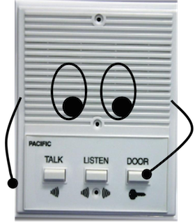
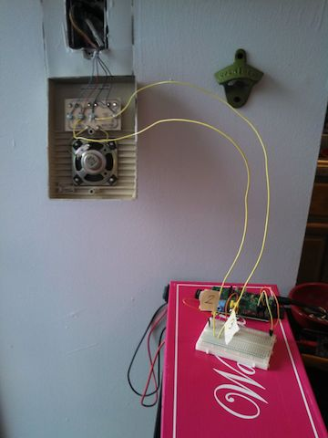

Buzzerbot 9000
===========

Source code for the Raspi/twilio/node robot that opens the door to my apartment building.

## Installing

Checkout this repo, and run npm install:

    git clone https://github.com/imightbeamy/buzzerbot9000.git
    cd buzzerbot9000
    npm install

This will...

* Install the needed node modules
* Install a cron to update a DDNS with https://freedns.afraid.org/
* Install an init.d script to start up the server

You'll also need to install and use [gpio-admin](https://github.com/quick2wire/quick2wire-gpio-admin):

    git clone https://github.com/quick2wire/quick2wire-gpio-admin.git
    cd quick2wire-gpio-admin
    make
    sudo make install

Add yourself to the gpio group:

    sudo adduser $USER gpio

If you're correctly in the group, you should see `gpio` when you run:

    groups

## Coming soon...
* Hardware Setup
* Show Facebook images of guests

My Raspberry pi running this connected to my apartment buzzer:

