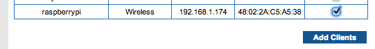
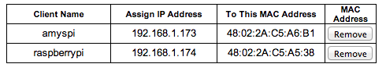
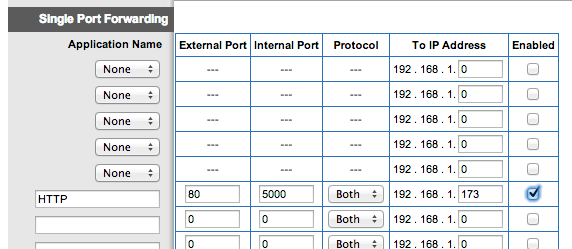
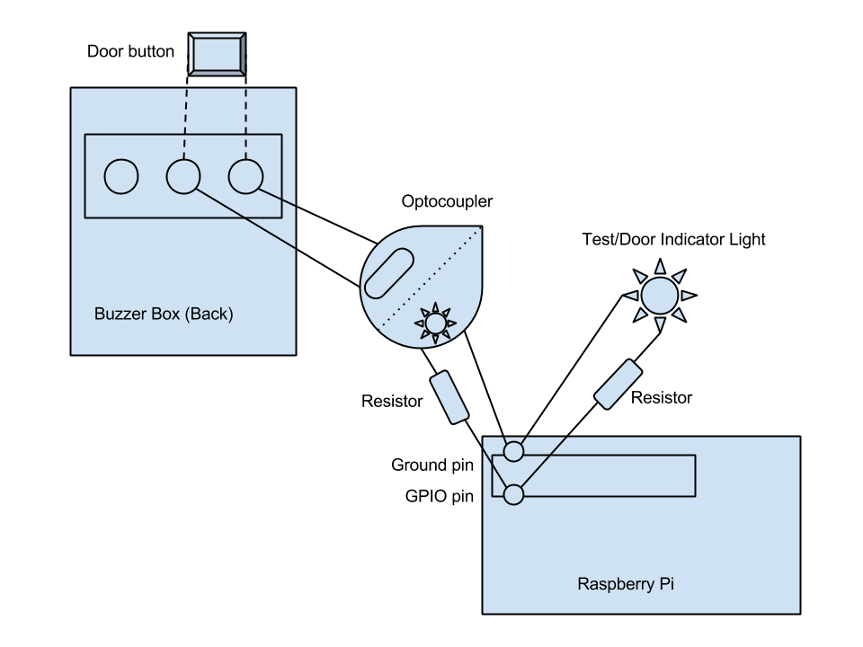
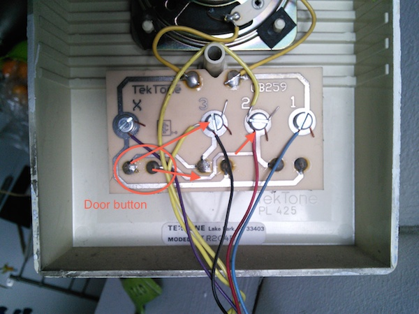
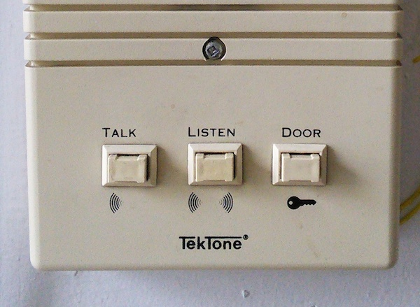
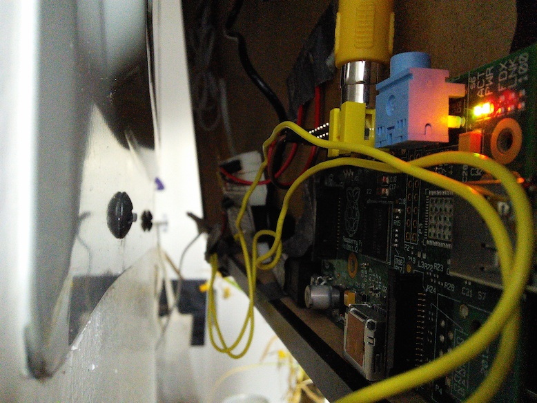
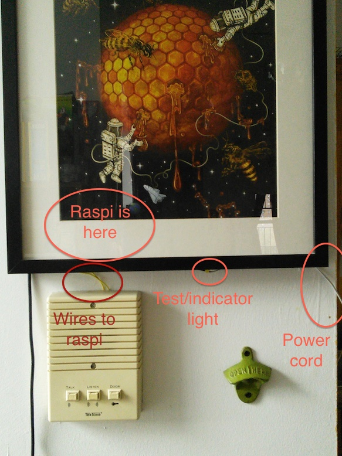
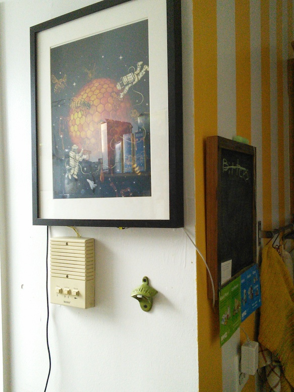
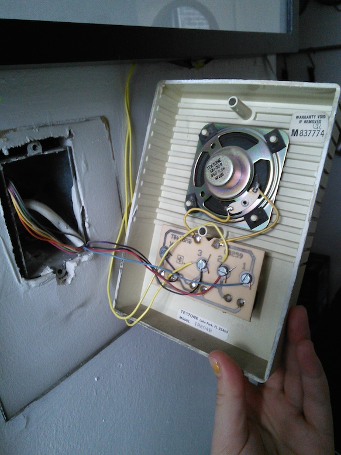

# DRAFT - This how-to is not done yet, follow at your own risk

# How to set up a buzzer bot

Chances are if you have a Raspberry pi, and you've done *anything* at all with it, you've turned on an LED. This project is almost as simple as that. The software requires a some set up, but hardware-wise, if you can turn on a LED, you can do this.

You'll need:

* A raspberry pie with [Node js installed](http://joshondesign.com/2013/10/23/noderpi)
* A domain from [freedns](https://freedns.afraid.org/)
* A [twilio account](https://www.twilio.com/) with a phone number
* An [optocoupler](http://en.wikipedia.org/wiki/Opto-isolator) (I used [this one](http://www.alliedelec.com/search/productdetail.aspx?SKU=70136788))
* Some resistors
* An LED
* Breadboard
* Wire

## Step 1: Install stuff!

See the [read me](README.md) for the basics of installing this code on your pi. Once you install it, rename `sample_config.json` to `config.json`. We'll need to fill in the blanks, but we'll get to that later.

## Step 2: Set up your test light

Before we connect anything to your buzzer box, let's set up a simple test light to make sure the software is set up right.

All we need right now is get one LED turning on and off, so I'm going to defer to another tutorial because there are lot of great ones already. [This is the one I used](https://projects.drogon.net/raspberry-pi/gpio-examples/tux-crossing/gpio-examples-1-a-single-led/), but if you find another you like that's fine too. Once you have an LED connected to your raspberry pi, come back here.

-----

So now that you have an LED turning on and off, open up config.json, and change `buzzer_pin` to the **physical pin** number that your LED is connected to. If you used the tutorial I mentioned above, you're number is 11. Otherwise you can use this handy digram, or count from the top left. 

TODO add link to digram.

Then, run [`node test.js`](test.js) and your LED should turn on for 2 seconds, and then turn off.

## Step 3: Finish software setup

Now that we can test it, let's get it hooked up to twilio!

### Routing
First you need to let your raspberry pi out onto the world wide web via your router, so twilio can get to it. I can't really tell you how to do this for your router, but you want to open up a port, and send that port to your raspberry pi's ip address. You'll probably need to give you raspberry pi a static ip on your local network.

Here'd how I did it on my router:

First I went to DHCP Reservation...


...and added my raspberry pi.



So it had a static ip.



Then I sent http traffic on port 80, to port 5000 on the ip address for my raspberry pi.



### DDNS service

Go to [freedns](https://freedns.afraid.org) and find "Dynamic DNS". At the button hit "[ add ]". Leave the type as "A", pick a subdomain (this can be whatever you want), pick on of the public domains (again whichever you want), and leave the destination (we'll update it from the pi).

Once you've saved it click on "Dynamic DNS" again and find the "Direct URL" for your subdomain. Copy everything after the ? into `freedns_key` in `config.json`.

TODO: separate cron install from main install and say to run it here. 

At this point you should be able to run `npm start` on your raspberry pi and you'll see some stuff like this
```
pi@amyspi ~/buzzerbot9000 $ npm start

> buzzerbot9000@0.0.0 start /home/pi/buzzerbot9000
> node server.js

Starting...
Listening on 5000
Error when trying to close pin 11
gpio-admin: could not flush data to /sys/class/gpio/unexport: Invalid argument
```

Once that's running you should be able to go to your to \<your domain\>/sms in a browder and see `Webhook Error - we attempted to validate this request without first configuring our auth token.` and see this on your raspberry pi `[Twilio]: Error - Twilio auth token is required for webhook request validation.`

### Twillio

Now we need to point twilio at the domain you just set up. Go to [twilio](https://www.twilio.com) and set up a number. Then go to the settings for that number and set the message request url to \<your domain\>/sms: 


Also grab your twilio Auth Token and fill in `twilio_token` in `config.json`.

Now when you run `npm start` and go to your domain it should say `Twilio Request Validation Failed.`, and if you text it, you should get a message back saying "Hmmm, that's not a password" but! If you open up `config.json` and put your phone number in the "sesame" whitelist, and then text "sesame" your test light should come on for a few seconds and go back off. 

## Step 4: Buzzer box time!

Your optocoupler has two sides: one side has an LED, the other a photo resistor.
When you turn the LED on, the resistor connects the leeds on the other side.
Your buzzer box has a "door" button. When you press the door button, it connects two wires and the door opens.

What we want to do is connect the LED side of the optocoupler to the raspberry, and the photo resistor side to the door button.
The raspberry pie will turn on the LED, which will connect the sides of the door button, and the door will open. Magic!

Here's a diagram:


I left my test light connected so I can see from my apartment when it's opening the door, but you don't have too. 

Here's a real life picture of my buzzer box. The light yellow wires (connected to #2 and #3) are the ones running to my pi. Either of these wires can go to either wire on the photo-resistors side of the optocoupler because photo-resistors are non-polarized.




Once you have the wires hooked up, running `test.js` should open your door!

## Strp 5: Put it all together

Now you should have everything hooked up, installed and configured. Try going outside and test it! 

Something isn't quite right? Did I leave something out? Be awesome and submit a pull request with a fix/addition to make things more clear. 

Thankd for follow this tutorial and [let me know](https://twitter.com/imightbeAmy) if you actully get this set up!

## Extra pictures

Here are some pictures of mine set up! I have my raspberry pi behind a deep picture frame that hangs above my buzzer box.





